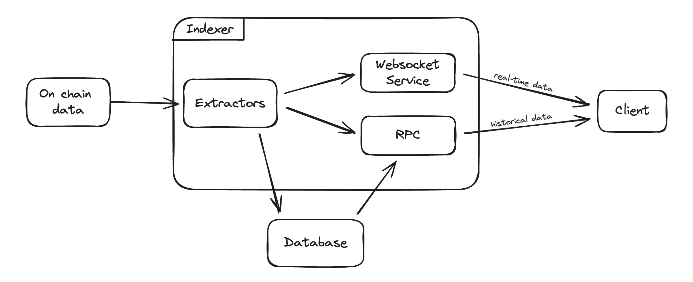

# Tycho Indexer

Tycho Indexer is a low-latency solution designed to track and update the state of onchain and offchain financial protocols in real time. With Tycho, clients can subscribe to a stream of state update messages or query historical states at any specific timestamp or block through an RPC interface.

Clients do not have to be aware of forks. In case the underlying chain experiences a fork, Tycho will automatically
resolve the fork and emit events. These events allow the clients to "revert" (through usual updates) to the correct
state as quickly as possible.

With Tycho, clients stay updated with the latest state of **all** protocols they are interested in. If they can handle all, they can get all.

## Supported implementations

Tycho supports two primary protocol implementation strategies:

- **Custom Protocol implementations:** Tycho defines custom structs that mirror the onchain state, typically aligning with smart contract languages like Solidity. State transitions are tracked by processing events or method calls.
- **Virtual Machine (VM) implementations:** In this strategy, state representation aligns more closely with the underlying VM, extracting and updating storage and other relevant contract attributes. This state is then passed to a VM instance for further functionality.

For both strategies, Tycho ensures seamless execution and integration with the overall system.

### Total Value Locked (TVL)

Each state allows annotation of TVL. This enables clients to filter for protocol components that are of particular interest to them.
This means users can easily focus on the aspects of the protocol components relevant to their needs, enhancing usability
and efficiency.

## Core Concepts:

#### Protocol Systems

A protocol system is a financial protocol defined by its swapping logic.
Tycho indexes entire protocol systems, including dynamically created components.
This means that components such as Uniswap pairs, which were not predetermined, are included in the indexing logic. They are automatically
added and indexed upon their creation/detection.

#### Protocol Components

A Protocol Component represents an entity that facilitates the swapping of two tokens. A component consists of static values that remain constant after creation. Separate to the _Protocol Component_ is the _Protocol Component State_. This is used to track the dynamic values of the component, which Tycho uses to maintain a historical record. For VM-based protocols, _Accounts_ (or Contracts) are also linked to the Protocol Component, providing contract code and storage values necessary for building historical states.

## Architecture

Tycho's architecture is designed to handle both real-time and historical data efficiently. On-chain data is processed by extractors, which then propagate the data to clients and storage. The RPC service allows clients to access stored data, combining it with real-time updates to reconstruct the current state of a protocol system.

Tycho consists of several crates, each responsible for different aspects of the system:

- `tycho-core`: defines the core structs and traits used throughout the Tycho system. More detailed docs [here](./tycho-core/README.md).
- `tycho-indexer`: contains the main logic used to process incoming data and propogate the relevant information to clients and storage. Includes the RPC service. More detailed docs [here](./tycho-indexer/README.md).
- `tycho-storage`: manages the underlying database and provides gateways for data access. More detailed docs [here](./tycho-storage/README.md).
- `tycho-client`: a rust client to simplify the start-up and managing of data from a Tycho connection. More detailed docs [here](./tycho-client/README.md).
- `tycho-client-py`: a python interface for the rust client and RPC service. More detailed docs [here](./tycho-client-py/README.md).
- `tycho-ethereum`: a module that integrates Ethereum-specific blockchain functionalities into Tycho. More detailed docs [here](./tycho-ethereum/README.md).

## Other Chains

Before moving to other chains the following things should be taken care of:

- Correctly implement ChainState struct to return the latest block by querying the chains rpc.
- Potentially fix assumption about fixed block times in the `tycho_client::feed`.
