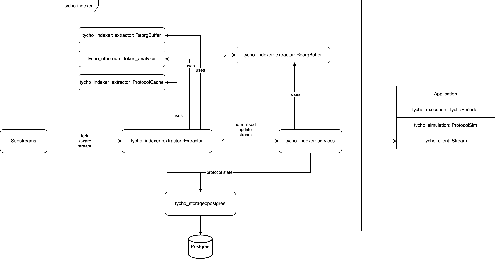

[![Telegram Chat][tg-badge]][tg-url]
[tg-badge]: https://img.shields.io/badge/chat-telegram-blue


# Tycho Indexer


Tycho Indexer gives you a low-latency, reorg-aware stream of all attributes you need to simulate swaps over DEX and other onchain liquidity.

For comprehensive documentation about tycho-indexer, visit our [GitBook](https://docs.propellerheads.xyz/tycho/for-solvers/indexer).

## How to Contribute

We warmly welcome open-source contributions!

**No contribution is too small and all contributions are valued.**

The [tycho.build Telegram](https://t.me/+B4CNQwv7dgIyYTJl) is available for any questions you may have that are not
covered in this guide.

### Ways to contribute

You can contribute in three ways:

1. **Open an issue:** For example, if you believe that you have uncovered a bug
   in Tycho, create a new issue in the issue tracker to report it.
2. **Add context:** Help resolve open issues by adding more context,
   such as screenshots and code snippets.
3. **Resolve an issue:** Open a pull request that fixes the issue, or demonstrates it's not an issue.

**Anybody can participate in any stage of contribution**. We encouarge you to participate in discussing issues and also to
participate in reviewing PRs.

### Opening a Pull Request

Please submit pull requests (PRs) targeting the main branch. Ensure all PR and commits titles follow the [Conventional Commit format](https://www.conventionalcommits.org/en/v1.0.0/) using a prefix like `fix: bug XXX`. This prefix is essential for automatically incrementing the version number.

Please ensure the following commands pass if you have changed the code:

```
cargo clippy --workspace --lib --all-targets --all-features
cargo +nightly fmt --check
```

### Join tycho.build

If you're interested in contributing, join us on Telegram at [tycho.build](https://t.me/+B4CNQwv7dgIyYTJl).

The Tycho community is eager to help you find an issue to work on and will support you throughout the
implementation process.

## Report a Vulnerability

Contact [security@propellerheads.xyz](mailto:security@propellerheads.xyz)

## Documentation

As Tycho is still in heavy development, the documentation can be a bit scattered.

The [Official Documentation](https://docs.propellerheads.xyz/tycho) is our current best-effort attempt at keeping up-to-date information.

## Architecture

Tycho's architecture is designed to handle both real-time and historical data efficiently. Extractors process on-chain data,
which then propagate the data to clients and storage. Clients can access stored data with the RPC service,
and combine it with streamed deltas to reconstruct the current state of a protocol system.



Tycho consists of several crates, each responsible for different aspects of the system:

- `tycho-simulation`: Provides tools for interacting with protocol states, calculating spot prices, and quoting token swaps. More detailed docs [here](https://docs.propellerheads.xyz/tycho/for-solvers/simulation).
- `tycho-execution`: Modules for encoding and executing swaps against Tycho router and protocol executors. [here](https://docs.propellerheads.xyz/tycho/for-solvers/execution)
- `tycho-common`: Defines the common structs and traits used throughout the Tycho system. More detailed docs [here](./tycho-common/README.md).
- `tycho-indexer`: Contains the main logic used to process incoming data and propogate the relevant information to clients and storage. Includes the RPC service. More detailed docs [here](./tycho-indexer/README.md).
- `tycho-storage`: Manages the underlying database and provides gateways for data access. More detailed docs [here](./tycho-storage/README.md).
- `tycho-client`: A rust client to simplify the start-up and managing of data from a Tycho connection. More detailed docs [here](./tycho-client/README.md).
- `tycho-client-py`: A python interface for the rust client and RPC service. More detailed docs [here](./tycho-client-py/README.md).
- `tycho-ethereum`: A module that integrates Ethereum-specific blockchain functionalities into Tycho. More detailed docs [here](./tycho-ethereum/README.md).

[tg-url]: https://t.me/+B4CNQwv7dgIyYTJl
