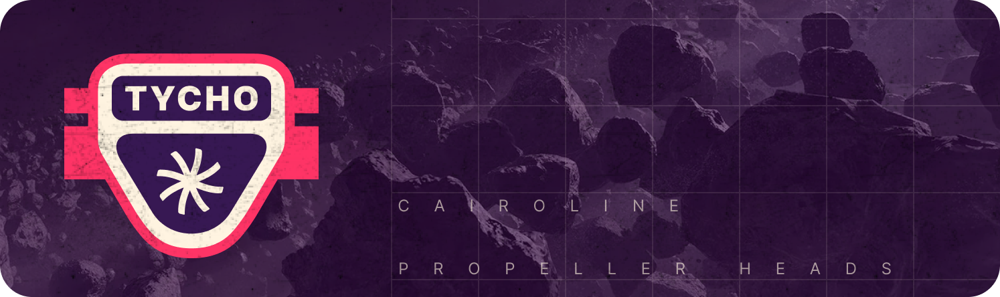

# Tycho Indexer



Tycho Indexer is a low-latency solution designed to track and update the state of onchain and offchain financial
protocols in real time. With Tycho, clients can subscribe to a stream of state update messages or query historical
states at any specific timestamp or block through an RPC interface.

Clients do not have to be aware of forks. In case the underlying chain experiences a fork, Tycho will automatically
resolve the fork and emit events. These events allow the clients to "revert" (through usual updates) to the correct
state as quickly as possible.

With Tycho, clients stay updated with the latest state of **all** protocols they are interested in. If they can handle
all, they can get all.

## How to Contribute

We warmly welcome open-source contributions!

**No contribution is too small and all contributions are valued.**

### Ways to contribute

There are fundamentally three ways an individual can contribute:

1. **By opening an issue:** For example, if you believe that you have uncovered a bug
   in Tycho, creating a new issue in the issue tracker is the way to report it.
2. **By adding context:** Providing additional context to existing issues,
   such as screenshots and code snippets to help resolve issues.
3. **By resolving issues:** Typically this is done in the form of either
   demonstrating that the issue reported is not a problem after all, or more often,
   by opening a pull request that fixes the underlying problem, in a concrete and
   reviewable manner.

**Anybody can participate in any stage of contribution**. We urge you to participate in the discussion around bugs and
participate in reviewing PRs.

### Opening a Pull Request

Please submit pull requests (PRs) targeting the main branch. Ensure all PR titles follow
the [Conventional Commit format](https://www.conventionalcommits.org/en/v1.0.0/). using
a prefix like `fix: bug XXX`. This prefix is essential for automatically incrementing the
version number.

Please ensure the following commands pass if you have changed the code:

```
cargo clippy --workspace --lib --all-targets --all-features
cargo +nightly fmt --check
```

### Join tycho.build

If you're interested in contributing, join us on Telegram at [tycho.build](https://t.me/+B4CNQwv7dgIyYTJl).
The Tycho community is eager to help you find an issue to work on and will support you throughout the
implementation process.

## Report a Vulnerability

Contact [security@propellerheads.xyz](mailto:security@propellerheads.xyz)

## Documentation

As Tycho is still in heavy development, the documentation can be a bit scattered.
The [Official Documentation](https://docs.propellerheads.xyz/tycho) is our
current best-effort attempt at keeping up-to-date information.

## Core Concepts:

#### Protocol Systems

A protocol system is a financial protocol defined by its swapping logic.
Tycho indexes entire protocol systems, including dynamically created components.
This means that components such as Uniswap pairs, which were not predetermined, are included in the indexing logic. They
are automatically
added and indexed upon their creation/detection.

#### Protocol Components

A Protocol Component represents an entity that facilitates the swapping of two tokens. A component consists of static
values that remain constant after creation. Separate to the _Protocol Component_ is the _Protocol Component State_. This
is used to track the dynamic values of the component, which Tycho uses to maintain a historical record. For VM-based
protocols, _Accounts_ (or Contracts) are also linked to the Protocol Component, providing contract code and storage
values necessary for building historical states.

## Architecture

Tycho's architecture is designed to handle both real-time and historical data efficiently. On-chain data is processed by
extractors, which then propagate the data to clients and storage. The RPC service allows clients to access stored data,
combining it with real-time updates to reconstruct the current state of a protocol system.


Tycho consists of several crates, each responsible for different aspects of the system:

- `tycho-common`: defines the core structs and traits used throughout the Tycho system. More detailed
  docs [here](./tycho-common/README.md).
- `tycho-indexer`: contains the main logic used to process incoming data and propogate the relevant information to
  clients and storage. Includes the RPC service. More detailed docs [here](./tycho-indexer/README.md).
- `tycho-storage`: manages the underlying database and provides gateways for data access. More detailed
  docs [here](./tycho-storage/README.md).
- `tycho-client`: a rust client to simplify the start-up and managing of data from a Tycho connection. More detailed
  docs [here](./tycho-client/README.md).
- `tycho-client-py`: a python interface for the rust client and RPC service. More detailed
  docs [here](./tycho-client-py/README.md).
- `tycho-ethereum`: a module that integrates Ethereum-specific blockchain functionalities into Tycho. More detailed
  docs [here](./tycho-ethereum/README.md).
