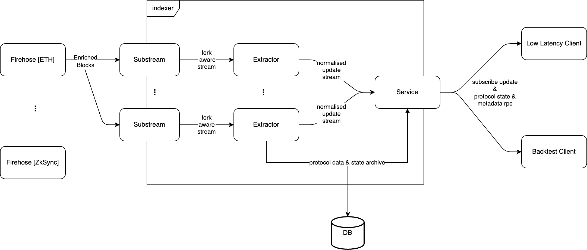

# Tycho Indexer

Tycho Indexer is the central component of the Tycho system, responsible for collecting, processing and aggregating on-chain data. It manages the flow of data, ensuring that it is efficiently processed and stored in the database, while also emitting it to subscribers in real time.

The system is divided into two main responsibilities: *Extractors* for incoming data and *Services* for outgoing data.

## Data Flow Overview

Currently, on-chain data is pushed into the Tycho system via Substreams. Substreams are specialized data pipelines designed to handle blockchain data. These Substreams send fork-aware messages to the tycho indexer for processing. The extractors consume these messages and propogate the relevant information to the client via websocket subscriptions, and to the database for storage.

[](https://drive.google.com/file/d/1mhbARX2ipAh-YUDfm4gPN3Is4sLvyJxM/view?usp=sharing)

In future iterations of Tycho we plan to enhance flexibility in data sources, enabling the system to support a broader range of pipelines beyond just Substreams.

## Extractors

Extractors are responsible for processing incoming data, archiving states, and providing normalized change streams. They receive fork-aware messages from Substreams and apply them to the current state. When relevant changes occur, namely changes that alter the state of the components or contracts monitored by the extractor, the extractors generate corresponding delta messages and immediately forward them to any active subscriptions.

As stateful components, extractors manage protocol components, their states, and their history. They also archive the messages they emit and track their processing progress using a cursor. This cursor allows Substreams to resume event emission from the exact point where it was left off, ensuring consistent state management.

#### Note

Tycho runs each extractor in a separate thread, allowing multiple extractors to operate concurrently within a single process. To minimize system latency, extractors should avoid heavy processing whenever possible.

### Reorg Handling

In the event of a chain reorganization (reorg), the extractor will build and emit a revert message containing information on how to reverse the changes that were previously emitted for the now-invalid blocks. This allows subscribers to restore their states to the block preceeding the fork. The extractor will then continue to process the subsequent blocks as usual, quickly catching up to the current block.

To handle reorgs efficiently, extractors utilize a *Reorg Buffer*. This buffer minimizes database load and enhances performance by temporarily storing unfinalized blocks until they are confirmed.

## Service

The services module is responsible for managing real-time data distribution and providing access to historical data via RPC (Remote Procedure Call) interfaces. The module offers two main services: WebSocket for live subscriptions and an RPC layer for querying state and historical data.

### Websocket Subscriptions

Tycho's WebSocket service allows clients to establish persistent connections to the system, receiving real-time updates on the state of specific on-chain components.

#### Key Features:

- Subscriptions: Clients can subscribe to various extractors based on their identity (e.g., a specific blockchain and protocol). Once subscribed, clients receive updates as soon as the extractor processes new data.
- Reorg Handling: In case of blockchain reorganisations, the system ensures that clients are notified with revert messages, allowing them to adjust their states accordingly.
- Heartbeat Mechanism: The WebSocket service includes a heartbeat mechanism to monitor client connection health. If the client fails to respond within a set timeout, the connection is automatically terminated.
- Error Handling: The service provides clear error messages for common issues like subscription failures, parsing errors, and missing extractors.

#### Usage

Clients can subscribe to an extractor by sending a Subscribe command with the extractor's identity. The WebSocket service then manages the data stream, delivering updates directly to the connected client.

```rust
// Example of a subscribe command
Command::Subscribe {
    extractor_id: ExtractorIdentity::new(Chain::Ethereum, "uniswap_v2"),
    include_state: true,
};

```

### RPC Service

Tycho's RPC service allows clients to query historical data and current state information. It supports several endpoints tailored for different use cases, such as retrieving contract states, tokens, and protocol components.

#### Protocol System Requirement

In the current design, specifying the `protocol_system` in your RPC requests is optional. However, it plays a critical role in ensuring accurate data retrieval. The protocol_system determines which extractor is used to calculate where to query states from (the buffer or the database). If not provided, the system defaults to using a random extractor, which may not always be fully synchronized. This can lead to inconsistencies or faulty responses.

In a future version of Tycho, the protocol_system parameter will become mandatory to eliminate these risks and ensure reliable, consistent data retrieval. Therefore, it is strongly recommended to always include protocol_system in your requests to guarantee accurate results.

#### Cache Management

The RPC service employs caching mechanisms to improve performance, particularly for frequently accessed data like tokens. This ensures that repeated requests for the same data are served quickly without redundant database queries.

### Future Enhancements

In future iterations, the service might be enhanced with the capability to stream historical events. This feature would enable complex backtesting use cases, enabling users to replay and analyze past blockchain events in real-time.

## Special Attributes

Tycho utilises several special attributes to support specific functionality. Some of these reserved attributes are static and can be found on the *Protocol Component*, however most are considered potentially dynamic and are found in the *Protocol State* (see [tycho-core](../tycho-core/README.md) docs for more information on these structs).

#### Protocol Component static attributes:
- `manual_updates`: indicates whether the component's updates should be applied automatically, i.e. whenever there is a change in any of the linked contracts, or manually triggered using the *update_marker* state attribute. In scenarios where a contract undergoes frequent changes, automatic updates may not be desirable. This field helps to control and prevent unnecessary updates in such cases. If omitted, updates should be applied on all changes.

#### Protocol State attributes:
- `update_marker`: indicates that the component state has changed and the update should be applied. This attribute should only be expected for protocol components that have the static attribute *manual_updates* set to true.
- `balance_owner`: specifies the address of the account that owns the protocol component's tokens. Omitted if the tokens are owned by the component itself.
- `stateless_contract_addr`: specifies the address of a stateless contract required by the component. An index is used if multiple stateless contracts are needed, for example `stateless_contract_addr_0`. For more complex protocols, a function could be defined here that should dynamically resolve and retrieve the stateless contract address.
- `stateless_contract_code`: specifies the code for a given *stateless_contract_address*. An index is used if multiple stateless contracts are needed, for example `stateless_contract_code_0`. The index must match with the related *stateless_contract_address*.

## Development

### Run tycho-indexer locally

The indexer services can be run using any of the following commands:

- `index` : Run the indexer service for every extractor set in `./extractors.yaml`
- `run` : Run the indexer service for a single extractor
- `analyze-tokens` : Run the token analyzer cronjob
- `rpc` : Run only the http RPC server

Each command can be used with the following:

```bash
cargo run --bin tycho-indexer -- \
    {your-command}
```

For more information about the flags, you can run:

```bash
cargo run --bin tycho-indexer -- \
    {your-command} --help
```

### Build tycho-indexer binary

To build the tycho-indexer binary and make it globally accessible on your system, follow these steps:

1. **Build the binary in release mode:**
```bash
cargo build --release
```

2. **Link the binary to a directory in your system's PATH:**
```bash
sudo ln -s $(pwd)/target/release/tycho-indexer /usr/local/bin/tycho-indexer
```
This creates a symbolic link, allowing you to run `tycho-indexer` from anywhere.
Note: Ensure that `/usr/local/bin/` is included in your system's PATH. On most systems, this is the default, 
but on minimalist Linux distributions or custom setups, you may need to verify or modify your PATH.

3. **Verify the installation:**
After completing the above steps, you can check that the binary is correctly linked by running:
```bash
tycho-indexer --help
```
This should display the help information for the `tycho-indexer` commands.
